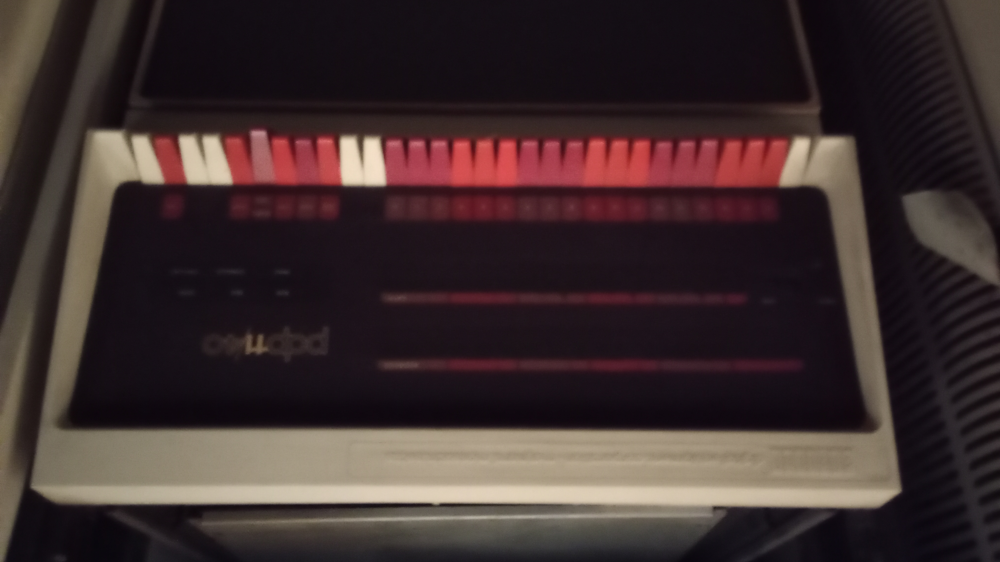
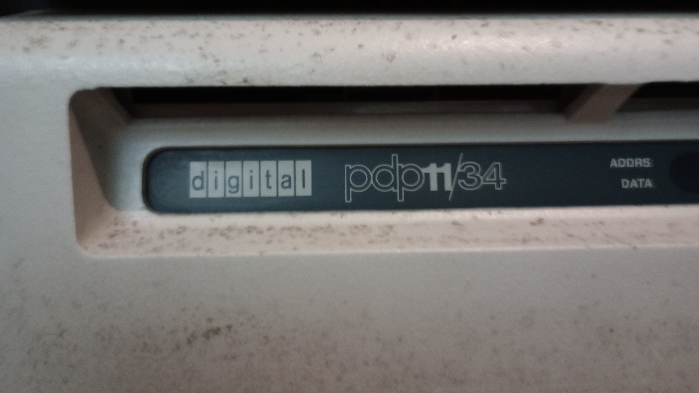
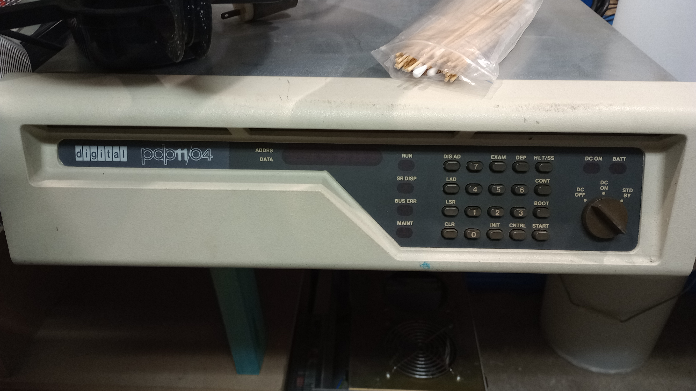
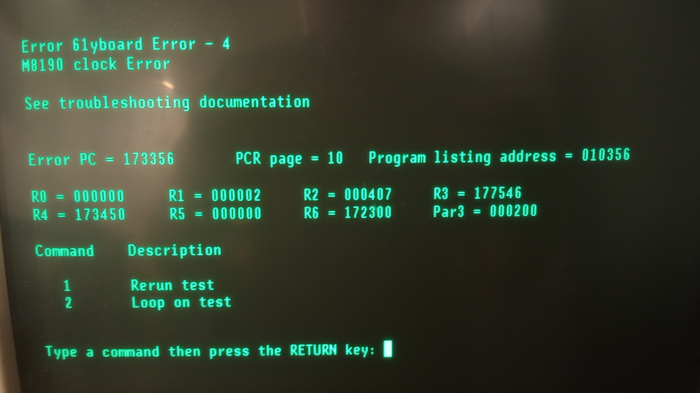
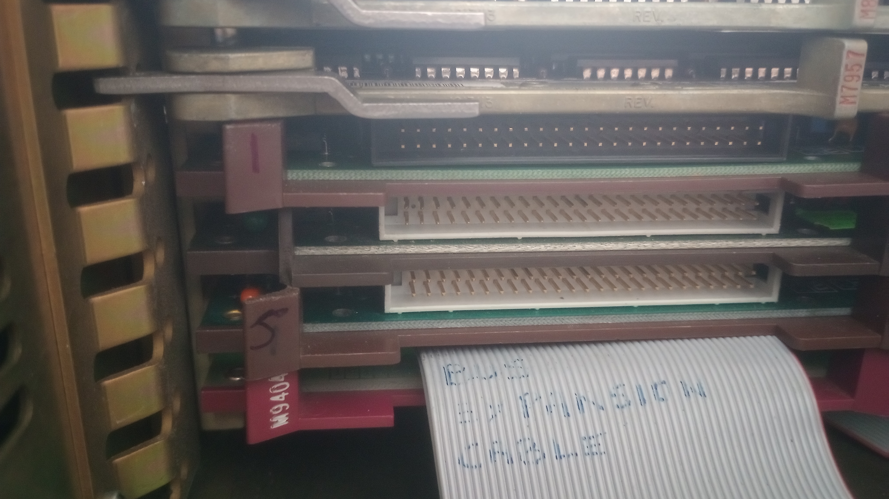
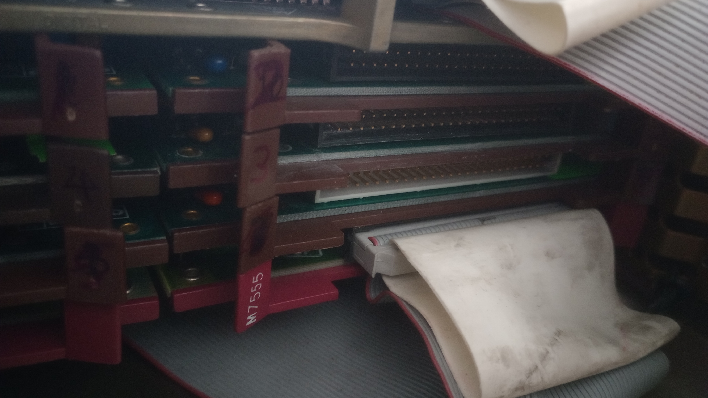
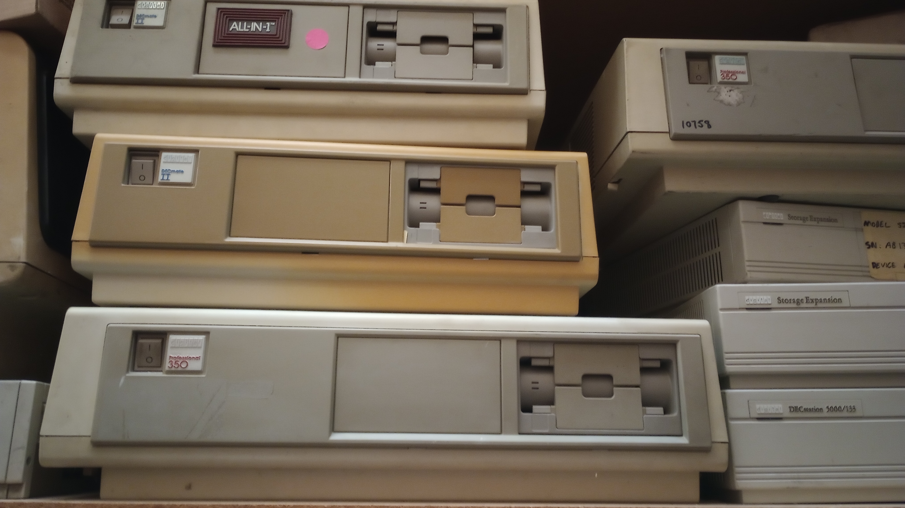
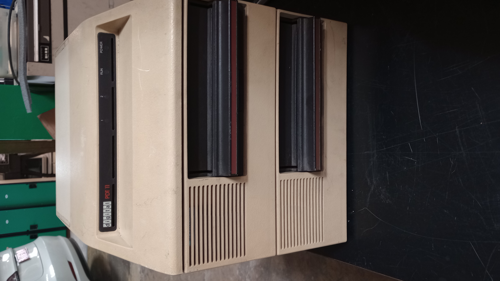
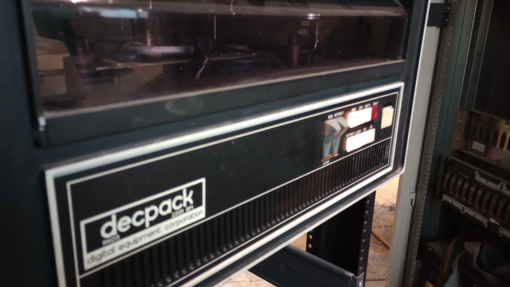

# ACMS Machines

[Australian Computer Museum Society ACMS)](https://acms.org.au) has a collection
of PDP-11 machine being refurbished.  Here are some images of the collection.

## PDP-11/40

Introduced in Janauary 1973.

It is a higher performance version of the PDP-11/20, with a microcoded multi-board CPU.
It uses the KD11-A CPU and an 18-bit MMU to support a maximum of 128 kw memory.
The CPU is connected to the KY11-D front panel via a pair of BC08-R flat cables.

Optional additions to the CPU included:

	- KT11-D Memory Management
	- KE11-E Extended Instruction Set (EIS)
	- KE11-F Floating Instruction Set (FIS floating point)
	- KJ11-A Stack Limit Register
	- KW11-L Line Time Clock

It came in two types of mounting boxes: the 21" BA11-F Mounting Box and the BA11-D/BA11-K
Mounting Boxes (later units).  The BA11-D used 9-pin DEC power distribution connectors,
whereas the BA11-K used the 6-pin/15-pin pair.

OS: DOS/BATCH, RSX11, RT-11, RSTS.

## PDP-11/34

The PDP-11/34 is DEC's lower-cost replacement to the PDP-11/40 for the UNIBUS.  It has
limited memory management capabilities of the PDP-11/40, as is was normally limited
to 248KB of main memory.

The CPU came in two variants: the KD11-E (M7265 and M7266) and the KD11-EA (M8265 and M8266).
Systems with the latter were denominated as a PDP-11/34A. Both required the DD11-P backplane.
The latter had provision for the FP11-A floating point unit, and the KK11-A cache.

Either BA11-L half-height or BA11-K mounting boxes could be used.  This model uses the
BA11-K mounting box.

Both the PDP-11/34 and PDP-11/34A could be provided with either the KY11-LA Operator's
Console or the KY11-LB Programmer's Console.  This model uses the KY11-LB console.

Note, as is usual for PDP-11 CPUS, neither the KD11-E nor the KD11-EA has built-in
termination and pull-ups for the UNIBUS.  The use of either an M9301 ROM or M9312 ROM
(which include bus termination) is required in slot 3 or 4 of the CPU's backplane.

This model is capable of running time-sharing, using memory management.

### Cards
	- M9312 - UNIBUS ROM and bus termination 
	- M7859 - KY11-LB console controller
	- M7254 - RK11-D disk controller
	- M7255 - RK11-D disk controller
	- M7256 - RK11-D disk controller
	- M7257 - RK11-D disk controller
	- M9202 - UNIBUS Jumper module (distribute AC loads and interconnect segments).

Boot ROM addresses: 773000-773776 (high ROM) and 765000-765776 (low ROM)

### Possible additional cards

	- M7762 RL controller
	- M7850 Parity controller
	- M7856 SLU/Clock
	- M7859 KB interface
	- M8264 SACK timeout module
	- M9301 Boot ROM + UNIBUS terminator
	- M9302 UNIBUS terminator

### Using the console

- CTRL-HALT for single-step
- CLR display
- enter address, then LOAD
- data, then DEP, then CLR, then loop
- enter address, then LOAD
- EXAM
- enter address, then LOAD, CTRL-START

### Bring-up code

Dump register to the serial console.

1000: 012701	; 
1001: 177564	;
1002: 105711	;
1003: 100376	;
1004: 110061	;
1005: 000002	; inc register
1006: 005200	;
1007: 000137	; jump
1008: 001006	; - address

## PDP-11/04

The PDP-11/04 is a mid/late-70s implementation of the PDP-11 architecture for the UNIBUS.

Essentially the same as PDP-11/34 except for different CPU boards.

It uses the KD11-D CPU, which was implemented on a single hex card (M7263).

The standard KY11-LA Operator's Console front panel had only 'Boot/Init', 'Halt/Cont',
and power switches, and the system came with an M9301 ROM card which included a console
emulator, which communicated through the console terminal.

Either BA11-L half-height or BA11-K mounting boxes could be used.  This model uses the BA11-L
model.

DEC did offer the KY11-LB Programmer's Console as an option for the PDP-11/04; it
had an octal keypad, the usual 'Halt'/'Start'/etc keys, and a 6-digit LED display
which showed address/data digitally.

## Micro PDP11/83

Released around 1985.  QBUS machine. BA-23 chassis?

KD-J11B CPU module

Cards:
	- M9404 Q22 bus cable connector - CPU box AB DUAL
	- M7555 RQDX3 MFM Winchester and floppy disk controller DUAL

Possible cofiguration:

Main Box:
S1 [B]M8637-EF[/B] [MSV11-JE  2-Mbyte ECC [PMI?] RAM Q22 Quad ABCD]
S2 [B]M8190-AE[/B] [KDJ11-BF   Q/U 11/83-84 CPU J11 CPU 18MHz with 2 boot & diagnostic ROMs, FPJ11-AA QUAD ABCD]
S3 [B]M9047[/B] [Q   Grant continuity] ,[COLOR=#ff0000]M9047 [Same but this one shouldn't be in a CD slot??][/COLOR]
S4 [B]M7196[/B] [TSV05 tape ctl for Q/Q22 QUAD ABAB capable]
S5 [B]M9047, M9047[/B] [Q   Grant continuity]
   [B]M8027[/B], [LPV11 Q  Printer Interface centronics DUAL]
S7 [B]M9047[/B],
   [B]M9047[/B] [Q   Grant continuity]
S8 [B]M7546[/B] [TQK50-AA TMSCP TK50 tape ctl DUAL]

## Professional 350

This model is equipped with 5.25-inch floppy disk drives and hard disks.
The design was intended to avoid software exchange with existing PDP-11 models.

The original operating system was P/OS, which was essentially RSX-11M+ with a menu
system on top.  The RT-11 operating system was eventually ported to the PRO series.

The model is based on the DCF-11 ("Fonz") chipset, the same as found in the PDP-11/23,
PDP-11/23+ and PDP-11/24.

The PRO-380 is based on the DCJ-11 ("Jaws") chipset, the same as found in the
PDP-11/53, PDP-11/73, PDP-11/83 and others, though running only at 10 MHz because
of limitations in the support chipset.

## PDT-11

The PDT-11 Series of user-programmable terminals.  The PDT-11 is based on the DEC
LSI-11 microprocessor, and supports a VT100 display terminal or DECwriter teleprinter
as the console plus up to three additional slave CRT or printer workstations.

All models are available with up to 60K bytes of RAM high speed memory. The PDT-11/130
also provides up to 512K bytes of mass storage via twin tape cartridges. The PDT-11/150
provides up to 512K bytes of mass storage via two 8-inch floppy disks, three
asynchronous serial ports, one printer port, one modem port and one synchronous serial
port.

All three employed the same chipset as used on the LSI-11/03 and LSI-11/2 processors.

## RK05

Introduced 1972, the RK05 is a disk drive using a 14", single-platter front-loading
removable disk.  The removable disk pack can hold about 2.5 MB.  2200BPI.

The UNIBUS controller was known as the RK11; it allowed the connection of up to
eight RK05 drives. Seeks could be overlapped among the drives but only one drive
at a time could transfer data.

The RK05J was the last model.

![RK05j(IMG_20230204_155330319.jpg)

## RL02

RL02 drives are moving head magnetic disk drives which store about 10MB (512 tracks)
on a removable data cartridge.  Up to four RL02 drives may be used, in any combination,
from a single controller.  An RL11 (UNIBUS) or RLV11/RLV12 adatper (QBUS) is
used as the controller.

!(IMG_20230204_162004029.jpg)
