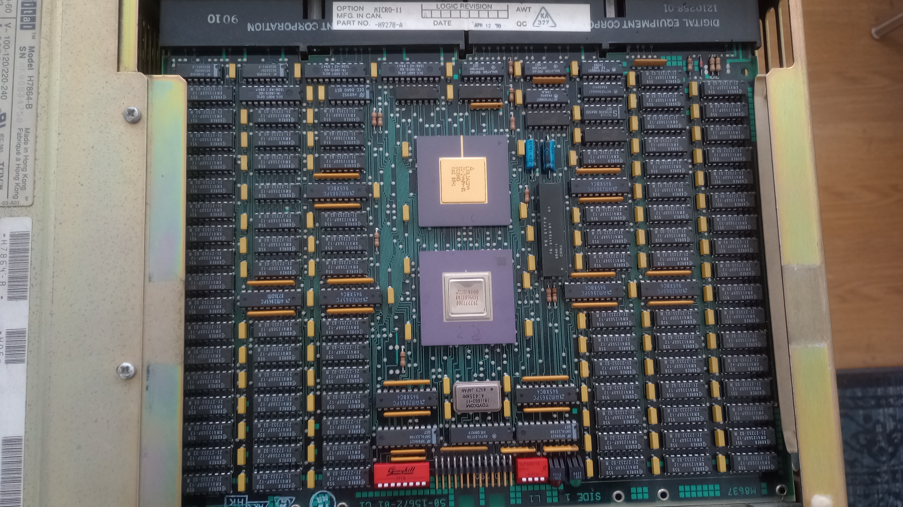

[Australian Computer Museum Society ACMS](https://acms.org.au) has a collection
of PDP-11 machine being refurbished.  Here are some images of the collection.

# PDP-11/40

Introduced in January 1973.

It is a higher performance version of the PDP-11/20, with a microcoded multi-board CPU.
It uses the KD11-A CPU and an 18-bit MMU to support a maximum of 128 kw memory.
The CPU is connected to the KY11-D front panel via a pair of BC08-R flat cables.

Optional additions to the CPU included:

- KT11-D Memory Management
- KE11-E Extended Instruction Set (EIS)
- KE11-F Floating Instruction Set (FIS floating point)
- KJ11-A Stack Limit Register
- KW11-L Line Time Clock

It came in two types of mounting boxes: the 21" BA11-F Mounting Box and the BA11-D/BA11-K
Mounting Boxes (later units).  The BA11-D used 9-pin DEC power distribution connectors,
whereas the BA11-K used the 6-pin/15-pin pair.

OS: DOS/BATCH, RSX11, RT-11, RSTS.

# PDP-11/34

Introducted in 1976. UNIBUS machine..

The PDP-11/34 is DEC's lower-cost replacement to the PDP-11/40 for the UNIBUS.  It has
limited memory management capabilities of the PDP-11/40, as is was normally limited
to 248KB of main memory.

The CPU came in two variants: the KD11-E (M7265 and M7266) and the KD11-EA (M8265 and M8266).
Systems with the latter were denominated as a PDP-11/34A. Both required the DD11-P backplane.
The latter had provision for the FP11-A floating point unit, and the KK11-A cache.

Either BA11-L half-height or BA11-K mounting boxes could be used.  This model uses the
BA11-K mounting box.

Both the PDP-11/34 and PDP-11/34A could be provided with either the KY11-LA Operator's
Console or the KY11-LB Programmer's Console.  This model uses the KY11-LB console.

Note, as is usual for PDP-11 CPUs, neither the KD11-E nor the KD11-EA has built-in
termination and pull-ups for the UNIBUS.  The use of either an M9301 ROM or M9312 ROM
(which include bus termination) is required in slot 3 or 4 of the CPU's backplane.

This model is capable of running time-sharing, using memory management.

## Modules

- M9312 : UNIBUS ROM and bus termination 
- M7859 : KY11-LB console controller
- M7254 : RK11-D disk controller
- M7255 : RK11-D disk controller
- M7256 : RK11-D disk controller
- M7257 : RK11-D disk controller
- M9202 : UNIBUS Jumper module (distribute AC loads and interconnect segments).

Boot ROM addresses: 773000-773776 (high ROM) and 765000-765776 (low ROM)

## Supported modules

- M7762 : RL11 disk controller (hex slot)
- M7850 : Parity controller
- M7856 : SLU/Clock
- M7859 : KB interface
- M8264 : SACK timeout module
- M9301 : Boot ROM + UNIBUS terminator
- M9302 : UNIBUS terminator

## Using the console

- CTRL-HALT for single-step
- CLR display
- enter address, then LOAD
- data, then DEP, then CLR, then loop
- enter address, then LOAD
- EXAM
- enter address, then LOAD, CTRL-START

## Bring-up code

Dump register to the serial console:

	1000: 012701	; mov $177564,r1
	1002: 177564	;
	1004: 105711	; tstb (r1)
	1006: 100376	; bpl 1004
	1010: 110061	; movb r0,2(r1)
	1012: 000002	;
	1014: 005200	; inc r0
	1017: 000137	; jmp @#1004
	1020: 001004

# PDP-11/04

Introduced in 1974.

Essentially the same as PDP-11/34 except for different CPU boards.  It uses the KD11-D CPU.

The standard KY11-LA Operator's Console front panel had only 'Boot/Init', 'Halt/Cont',
and power switches, and the system came with an M9301 ROM card which included a console
emulator, which communicated through the console terminal.

Either BA11-L half-height or BA11-K mounting boxes could be used.  This model uses the BA11-L
mounting box.

DEC did offer the KY11-LB Programmer's Console as an option for the PDP-11/04; it
had an octal keypad, the usual 'Halt'/'Start'/etc keys, and a 6-digit LED display
which showed address/data digitally.

## Modules

- M7263 : KD11-D CPU [hex slot]

# Micro PDP11/83

Introduced in 1985.  QBUS machine.  The BA-23 enclosure is a tabletoph 8-slot enclosure
with 120/240V 230W power supply (177mm H x 562mm W x 726mm D).  Maybe rackmount?

See details in the [Micro PDP-11 System on bitsavers.org](http://www.bitsavers.org/pdf/dec/pdp11/microPDP11/EK-MIC11-TM-002_MicroPDP11_Systems_Technical_Manual_Sep85.pdf).

## Modules:

- M8190 : KD-J11-BF CPU @ 18MHz PMI with 2 boot/diagnostic ROMs + FPJ11-AA FPU [quad slot]
- M8637 : MSV11-JE 2MB ECC DRAM [quad slot]
- M7957 : DZV11 quad asynchronous multiplexer with RS232C interfaces [quad slot]
- 2x	: WGDZV/04 Webster [dual slot]
- 3x	: WGDZV/06 Webster [dual slot]
- 1x	: SDZV11/03 Webster [dual slot]
- M9404 : Q22 bus cable connector [dual slot]
	- connects to M9405 Q22 bus mirror
- M7555 : RQDX3 MFM Winchester and floppy disk controller for RX50/RD50-54/RD31/RD32) [dual slot]

## Supported modules

- M3104 : DHV11-A 8-line async DMA mux [quad slot]
- M7196 : TSV05 tape controller for Q/Q22 [quad slot]
- M7504 : DEQNA-AA ethernet adapter [dual slot]
- M7546 : TQK50-AA TK50 tape controller [dual slot]
- M8027 : LPV11 Printer Interface centronics [dual slot]
- M8013 : RLV11 disk controller for RL01/RL02 drives [quad slot]
- M8014 : RLV11 communicates with M8013 over CD interconnect [quad slot]
- M8017 : DLV11-EC single line async control module [dual slot]
- M8061 : RLV12 disk controller for RL01/RL02 drive [quad slot]
- M8637 : MSV11-JD 1MB ECC DRAM [quad slot]
- M9047 : Grant continuity [dual slot]

## ROM functions

ROM should be mapped to addresses 17765000 - 17765776 (0x3FEA00 - 0x3FEBFE)

Looks like ROM is actually present at 163000 + CSR=10

At startup the ROM performs the following functions:

	run self-test diagnostics
	load the first 105 bytes (setup table )of the EEPROM into memory beginning at location 2000.
	boot according to configuration in setup table;
		boot from specified device
		enter dialog mode
		enter halt mode

Typing <CTRL> C during self-test stops the test and causes the system to
attempt to boot as if the self-test had completed successfully. 

Typing <CTRL> P during the boot process causes the system to immediately 
enter dialog mode.

Dialog mode has the following commands:

	Help : describe each command
	Boot <device> : boot from device
	List : show supported boot devices
	Setup : enter setup mode
	Map : show memory map
	Test :  running self test in a loop

Setup mode has the following commands:

	1 : exit
	2 : list/modify setup table
	3 : list/modify boot translation in setup table
	4 : list/modify terminal setup message in setup table
	6 : list/modify switch boot selection in setup table
	7 : list boot programs
	8 : initialize setup table
	9 : save setup table
	10 : load setup table
	11 : delete boot
	12 : load boot into memory
	13 : edit/create boot
	14 : save boot
	15 : Enter ROM ODT

## Front Panel DIP switches

Behind the front panel on the circuit board there is a 2-switch bank of DIP
switches.  The function of the DIP switches are:

	SW1 : OFF = Enable Q22-bus BEVENT
	SW2 : OFF = Disable front-panel Reset button

## M8190 E83 DIP switches

The normal setting for all 8 switches is OFF.  Otherwise the boot device
is specified:

SW2/3/4 have the following function:

	0 = boot automatically to dialog mode settings
	1 = boot device 1
	2 = boot device 2
	3 = boot device 3
	4 = boot device 4
	5 = boot device 5
	6 = boot device 6
	7 = boot according to SW1

SW1 OFF specifies to boot to ODT, otherwise run self-test diagnostics.

SW5 OFF specifies system to enter dialog mode.

SW5/6/7/8 specified console baud rate if external rotary on the back panel
is not installed.  If the back panel is present, these switches must be OFF.

## Error 61: M8190 clock Error

The clock is on the KD-J11-B CPU module.  Try changing the swiches behind
the front panel.  Then try going into setup and set
the line time clock source to 50Hz instead of AC line frequency
(Parameter ), 0=power, 1=50Hz, 2=60Hz, 3=80Hz)

## RSX Operating System

# BA11-SF Enclosure

QBUS Expander box.

## Modules

- M7606 : KA630-AA MicroVAX II CPU, 22-bit QBUS, with FPU [quad slot]
- M7609 : MS630-CA 8MB Memory module, [quad slot]
- M7504 : DEQNA-AA ethernet adapter [dual slot]

# Professional 350

Introduced in 1982.

This model is equipped with 5.25-inch floppy disk drives and hard disks.
The design was intended to avoid software exchange with existing PDP-11 models.

The original operating system was P/OS, which was essentially RSX-11M+ with a menu
system on top.  The RT-11 operating system was eventually ported to the PRO series.

The model is based on the DCF-11 ("Fonz") chipset, the same as found in the PDP-11/23,
PDP-11/23+ and PDP-11/24.

The PRO-380 is based on the DCJ-11 ("Jaws") chipset, the same as found in the
PDP-11/53, PDP-11/73, PDP-11/83 and others, though running only at 10 MHz because
of limitations in the support chipset.

# PDT-11

Introduced in 1976.

The PDT-11 Series of user-programmable terminals.  The PDT-11 is based on the DEC
LSI-11 microprocessor, and supports a VT100 display terminal or DECwriter teleprinter
as the console plus up to three additional slave CRT or printer workstations.

All models are available with up to 60K bytes of RAM high speed memory. The PDT-11/130
also provides up to 512K bytes of mass storage via twin tape cartridges. The PDT-11/150
provides up to 512K bytes of mass storage via two 8-inch floppy disks, three
asynchronous serial ports, one printer port, one modem port and one synchronous serial
port.

The floppy drives are single-sided single-density 8-inch drives (not based on the RX01
or RX02 floppy drive), but they are compatible with RX01 format and have an interface
that is sort-of RX11-like. The interface is not compatible with the RX11.

All three models cemployed the same chipset as used on the LSI-11/03 and LSI-11/2 processors.

The PDT-11 runs a stripped down version of RT11. The PDT-11/130 and PDT-11/150 use
the same PD.SYS driver in RT-11, with help from the standardized ROM which handles
the hardware-specific stuff.  The PDT-11/150 cannot boot from a regular RT11 floppy.
The RXT11 controller is not quite compatible with the RXV11.

There is a way to make a PDT-11/150 boot disk using a normal RT11 distribution kit.
One of the floppies in the RX01 distribution kit is bootable on the PDT-11.
There are special drivers for the floppies and a special boot block.

The I/O page of the PDT-11 is emulated by the 8085A processor.

# RK05

Introduced 1972, the RK05 is a disk drive using a 14", single-platter front-loading
removable disk.  The removable disk pack can hold about 2.5 MB.  2200BPI.

The UNIBUS controller was known as the RK11; it allowed the connection of up to
eight RK05 drives. Seeks could be overlapped among the drives but only one drive
at a time could transfer data.

The RK05J was the last model.

![RK05j(IMG_20230204_155330319.jpg)

# RL02

RL02 drives are moving head magnetic disk drives which store about 10MB (512 tracks)
on a removable data cartridge.  Up to four RL02 drives may be used, in any combination,
from a single controller.  An RL11 (UNIBUS) or RLV11/RLV12 adapter (QBUS) is
used as the controller.

